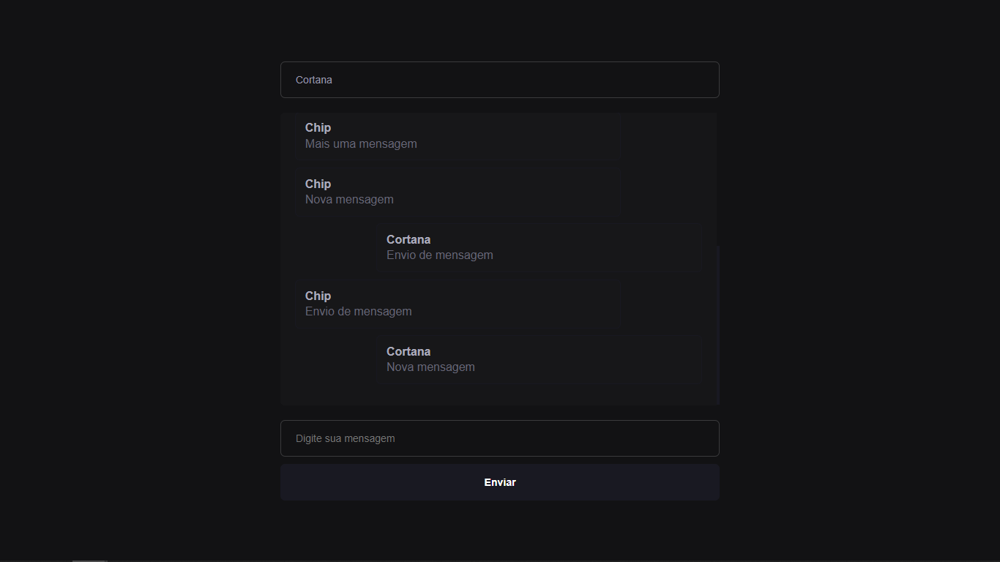

# CHAT COM SOCKET.io


## Iniciando a Aplicação
  - Para iniciar o projeto rodamos o comando a seguir para criar o nosso package.json.
    ``` npm init -y ```
  - Após isso instalaremos algumas dependências que serão utilizadas no projeto:
    ``` yarn add ejs express socket.io ```
    - ejs: template engine padrão do node
    - express: framework do node
    - socket: meio de comunicação entre o front e backend

## Websocket
  - É um novo protocolo, assim como existe o protocolo HTTP, existe também o WSS que é o que utilizaremos aqui.
  - Uma grande vantagem do socket é que podemos enviar objetos inteiros em uma requisição, sem precisar converter para string ou algo do tipo.

## Criando/Configurando o arquivo server.js
  - Esse arquivo é o primeiro a ser acessado pela aplicação, e é o que definirá quais arquivos serão chamados a seguir.
  
  - **Importando Dependências:** Primeiro faremos as importações das dependências:
    ```
      const express = require('express');
      const path = require('path');
    ```
  - **Configurando Protocolos:** Com estas dependências, já na aplicação, iremos definir os dois protocolos que serão utilizados, HTTP e WSS
    ```
      const app = express();
      const server = require('http').createServer(app);
      const io = requrie('socket.id')(server);
    ```
  - **Configurando Views:** Aqui diremos a aplicação que as views serão criadas em HTML.
    ```
      app.use(express.static(path.join(__dirname, 'public')));
      app.set('views', path.join(__dirname, 'public'));
      app.engine('html', require('ejs').renderFile);
      app.set('view engine', 'html');
    ```
## Criando Rotas em Server.js
  - Após as configurações inicias que chamaram as dependências, definiram os protocolos de comunicação e especificaram qual o tipo de arquivo que renderizará as views podemos criar as rotas da aplicação.

  - **Rotas HTTP(Para o Frontend)**
    ```
      app.use('/', (req, res) => {
        res.render('index.html');
      });
    ```
  - **Rotas WSS**
    ```
      io.on('connection', socket => {
        console.log(`Socket conectado ${socket.id}`)
      });
    ```

## Frontend
  - No frontend necessitaremos importar dois scripts, que serão o JQuery, para facilitar o uso da DOM, e o socket.io para fazer as requisições. Ambos utilizaremos o cdn.
  ```
    <script src="https://cdnjs.cloudflare.com/ajax/libs/jquery/3.3.1/jquery.min.js"></script>
    <script src="https://cdnjs.cloudflare.com/ajax/libs/socket.io/4.2.0/socket.io.js"></script>
  ```
  - Deve se ter cuidado com a versão do socket, pois ela deve ser compatível ao mesmo websocket rodando no backend.

## Configurando porta e executando projeto
  - **Configurando porta da aplicação:** O código abaixo especifica que a aplicação estará ouvindo a porta 3000 da aplicação.
    ```
      server.listen(3000)
    ```
  - **Executando:** Para executar o programa basta rodar o comando:
    ```
      node server.js
    ```

## Configurando Socket no Frontend
  - Com a aplicação rodando e com o scripts importados no frontend temos que fazer o frontend se comunicar com o backend, para isso fazemos o seguinte comando.
  ```
    var socket = io('http://localhost:3000');
  ```
  - Após esse comando já teremos a variável de conexão, que utilizaremos para enviar nossas requisições.

## Enviando e recebendo requisições via socket
  - Para enviar um requisição, basta utilizar a função emit colocando o nome do evento e passando o objeto a ser enviado em seguida.
  ```
    var messageObject = {
      author: author,
      message: message,
    };

    socket.emit('sendMessage', messageObject);
  ```

  - Para receber a requisição, dentro da função que monitora as conexões devemos ouvir o evento enviado, da seguinte maneira:
  ```
    io.on('connection', socket => {
      console.log(`Socket conectado ${socket.id}`);

      socket.on('sendMessage', data => {
        messages.push(data);
        socket.broadcast.emit('receivedMessage', data);
      });
    });
  ```

## Principais funções do socket
  - **emit**: Envia uma requisição para o backend
  - **on**: Fica escutando eventos
  - **broadcast.emit**: Enviará para todos os sockets conectados na aplicação